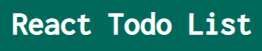

# REACT TODO LIST

>This project was bootstrapped with [Create React App](https://github.com/facebook/create-react-app).

## Description
React Todo List is a simple todo list app built with react and [json-server](https://github.com/typicode/json-server) as a backend.

It was buitl as part of practise for building frontend apps with [**React Library**](https://reactjs.org/)

## Features 📎
* Add tasks
* Manage tasks

## Requirements
* [Node](https://nodejs.org/en/)

## Instalation 💾
1. Run `git clone https://github.com/JacobJax/React-todo-list.git` or click on the dropdown and download the project as a zipped file.
1. Run `npm install` to install node_modules
1. Run `npm run server` to start **json-server**

The app will run on **`'http://localhost:3000/'`**

## Usage💻
### Adding a task
To add a task, enter the name of the task in the `Add task` form 

then press `enter` or click the `Add todo` button to submit

>### NOTE
>If you dont enter a `task name`, you'll receive an error alert

### Setting a task to complete

Once you are done with a task, `double click` on the task to set it as complete.

### Deleting a task
To delete a completed task or any other task, click on the `delete` button.

Thats pretty much everything about it🙂. 
Feel free to contribute to the [project.]( https://github.com/JacobJax/React-todo-list.git) 
